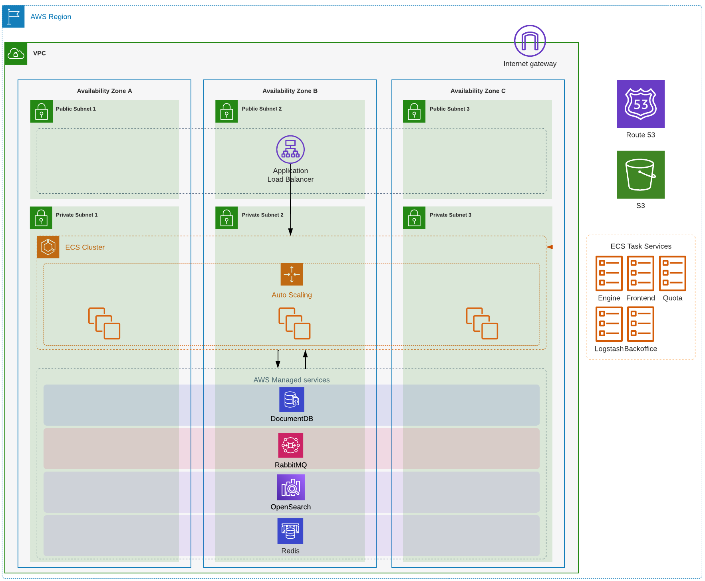

#  AWS appmixer Terraform module

## Description
A Terraform module to provision appmixer application.

## Configuration

### Autoscaling configuration
Autoscaling is configured using `ecs_autoscaling_config` variable which by default defines two [capacity providers](https://docs.aws.amazon.com/AmazonECS/latest/developerguide/cluster-capacity-providers.html) used while scaling the cluster.
 - `on_demand` - capacity provider alocates on demand EC2 instances which are more expensive but are always available
 - `spot` - capacity provider alocates spot EC2 instances which are cheaper but can be terminated at any time, therefore it is recommended to use spot instances as temporary capacity

 To see more info about capacity provider configuration see [aws_autoscaling_group configuration](https://registry.terraform.io/providers/hashicorp/aws/latest/docs/resources/autoscaling_group)

> :warning: **Instance types**: The size of EC2 network interfaces (ENIs) for each instance type is restricted, and this limitation is directly tied to the number of containers that can be executed on the instance. To avoid this limitation, please consider using instances types that allow so-called `ENI Trunking` meaning EC2 can attach more network interfaces (see more [AWS Docs](https://docs.aws.amazon.com/AmazonECS/latest/developerguide/container-instance-eni.html))
 Also ENI Trunking **must be allowed** in AWS account ([AWS ECS]( https://console.aws.amazon.com/ecs/v2) -> Account Settings -> AWSVPC Trunking -> Enable)

### Managed services
RabbitMQ, Opensearch (Elasticsearch), ElasticCache (Redis), DocumentDB(Mongo) are managed by AWS and can be configured through variables:
- `document_db`
- `elasticache`
- `elasticsearch`
- `rabbitmq`

Each service is running with minimal configuration, in production they might need some resizing.

### User initialization
Admin user is initialized through automated task running in ECS. Variable `init_user` needs to be set.

### Deployment
- the service `engine` is waiting for creation of index in DocumentDB which might take around 20min till service become available, therefore the **User initialization** will fail and needs to be repeated by running `terraform plan` again
-

## Examples
See [Development example](examples/development/README.md) for further information.
See [Production example](examples/production/README.md) for further information.

## Architecture
 

<!-- BEGINNING OF PRE-COMMIT-TERRAFORM DOCS HOOK -->
## Requirements

| Name | Version |
|------|---------|
|  [terraform](#requirement\_terraform) | >= 1.6.6 |
|  [aws](#requirement\_aws) | >= 5.32.1 |
|  [http](#requirement\_http) | 3.4.1 |
|  [random](#requirement\_random) | >= 3.6.0 |

## Modules

| Name | Source | Version |
|------|--------|---------|
|  [alb](#module\_alb) | terraform-aws-modules/alb/aws | ~> 9.0 |
|  [autoscaling](#module\_autoscaling) | terraform-aws-modules/autoscaling/aws | ~> 6.5 |
|  [autoscaling\_sg](#module\_autoscaling\_sg) | terraform-aws-modules/security-group/aws | ~> 5.0 |
|  [document\_db\_ssm\_password](#module\_document\_db\_ssm\_password) | cloudposse/ssm-parameter-store/aws | 0.11.0 |
|  [document\_db\_ssm\_username](#module\_document\_db\_ssm\_username) | cloudposse/ssm-parameter-store/aws | 0.11.0 |
|  [documentdb\_cluster](#module\_documentdb\_cluster) | cloudposse/documentdb-cluster/aws | 0.24.0 |
|  [ecs\_cluster](#module\_ecs\_cluster) | terraform-aws-modules/ecs/aws//modules/cluster | 5.7.4 |
|  [ecs\_service\_backoffice](#module\_ecs\_service\_backoffice) | terraform-aws-modules/ecs/aws//modules/service | 5.7.4 |
|  [ecs\_service\_engine](#module\_ecs\_service\_engine) | terraform-aws-modules/ecs/aws//modules/service | 5.7.4 |
|  [ecs\_service\_frontend](#module\_ecs\_service\_frontend) | terraform-aws-modules/ecs/aws//modules/service | 5.7.4 |
|  [ecs\_service\_logstash](#module\_ecs\_service\_logstash) | terraform-aws-modules/ecs/aws//modules/service | 5.7.4 |
|  [ecs\_service\_quota](#module\_ecs\_service\_quota) | terraform-aws-modules/ecs/aws//modules/service | 5.7.4 |
|  [elasticache](#module\_elasticache) | cloudposse/elasticache-redis/aws | 1.0.0 |
|  [elasticache\_ssm\_password](#module\_elasticache\_ssm\_password) | cloudposse/ssm-parameter-store/aws | 0.11.0 |
|  [elasticsearch](#module\_elasticsearch) | cloudposse/elasticsearch/aws | 0.46.0 |
|  [elasticsearch\_ssm\_password](#module\_elasticsearch\_ssm\_password) | cloudposse/ssm-parameter-store/aws | 0.11.0 |
|  [elasticsearch\_ssm\_username](#module\_elasticsearch\_ssm\_username) | cloudposse/ssm-parameter-store/aws | 0.11.0 |
|  [label](#module\_label) | cloudposse/label/null | 0.25.0 |
|  [rabbit\_mq](#module\_rabbit\_mq) | cloudposse/mq-broker/aws | 3.1.0 |
|  [s3\_bucket](#module\_s3\_bucket) | cloudposse/s3-bucket/aws | 4.0.1 |
|  [services\_configuration\_merge](#module\_services\_configuration\_merge) | cloudposse/config/yaml//modules/deepmerge | 1.0.2 |
|  [sg\_document\_db\_rules](#module\_sg\_document\_db\_rules) | cloudposse/security-group/aws | 2.2.0 |
|  [sg\_user\_init](#module\_sg\_user\_init) | cloudposse/security-group/aws | 2.2.0 |
|  [sq\_elasticsearch](#module\_sq\_elasticsearch) | cloudposse/security-group/aws | 2.2.0 |
|  [subnets](#module\_subnets) | cloudposse/dynamic-subnets/aws | 2.4.1 |
|  [vpc](#module\_vpc) | cloudposse/vpc/aws | 2.1.1 |

## Resources

| Name | Type |
|------|------|
| [aws_acm_certificate.alb](https://registry.terraform.io/providers/hashicorp/aws/latest/docs/resources/acm_certificate) | resource |
| [aws_acm_certificate_validation.this](https://registry.terraform.io/providers/hashicorp/aws/latest/docs/resources/acm_certificate_validation) | resource |
| [aws_cloudwatch_log_group.ecs_mongo_init_user](https://registry.terraform.io/providers/hashicorp/aws/latest/docs/resources/cloudwatch_log_group) | resource |
| [aws_ecs_task_definition.this](https://registry.terraform.io/providers/hashicorp/aws/latest/docs/resources/ecs_task_definition) | resource |
| [aws_elasticsearch_domain_policy.this](https://registry.terraform.io/providers/hashicorp/aws/latest/docs/resources/elasticsearch_domain_policy) | resource |
| [aws_route53_record.alb](https://registry.terraform.io/providers/hashicorp/aws/latest/docs/resources/route53_record) | resource |
| [aws_route53_record.cert_alb](https://registry.terraform.io/providers/hashicorp/aws/latest/docs/resources/route53_record) | resource |
| [aws_service_discovery_http_namespace.appmixer](https://registry.terraform.io/providers/hashicorp/aws/latest/docs/resources/service_discovery_http_namespace) | resource |
| [random_password.elasticsearch_password](https://registry.terraform.io/providers/hashicorp/random/latest/docs/resources/password) | resource |
| [random_password.rabbit_mq](https://registry.terraform.io/providers/hashicorp/random/latest/docs/resources/password) | resource |
| [random_password.redis_password](https://registry.terraform.io/providers/hashicorp/random/latest/docs/resources/password) | resource |
| [random_pet.document_db_username](https://registry.terraform.io/providers/hashicorp/random/latest/docs/resources/pet) | resource |
| [random_pet.elasticsearch_username](https://registry.terraform.io/providers/hashicorp/random/latest/docs/resources/pet) | resource |
| [aws_ecs_task_execution.run](https://registry.terraform.io/providers/hashicorp/aws/latest/docs/data-sources/ecs_task_execution) | data source |
| [aws_region.current](https://registry.terraform.io/providers/hashicorp/aws/latest/docs/data-sources/region) | data source |
| [aws_ssm_parameter.ecs_optimized_ami](https://registry.terraform.io/providers/hashicorp/aws/latest/docs/data-sources/ssm_parameter) | data source |
| [aws_vpc.external](https://registry.terraform.io/providers/hashicorp/aws/latest/docs/data-sources/vpc) | data source |
| [http_http.init_user](https://registry.terraform.io/providers/hashicorp/http/3.4.1/docs/data-sources/http) | data source |

## Inputs

| Name | Description | Type | Default | Required |
|------|-------------|------|---------|:--------:|
|  [init\_user](#input\_init\_user) | Initial user created in appmixer. Creation through appmixer API and by setting up admin scope in documentdb directly | <pre>object({     email    = string     username = string     password = string   })</pre> | n/a | yes |
|  [root\_dns\_name](#input\_root\_dns\_name) | Root DNS name, must be applicable to route53 zone (zone\_id) | `string` | n/a | yes |
|  [additional\_security\_group\_rules](#input\_additional\_security\_group\_rules) | Additional security group rules added to security group rules of all resources, see more [Terraform docs](https://registry.terraform.io/providers/hashicorp/aws/latest/docs/resources/security_group_rule) | <pre>list(object({     type              = string     from_port         = number     to_port           = number     protocol          = string     cidr_blocks       = optional(list(string))     ipv6_cidr_blocks  = optional(list(string))     security_group_id = optional(string)   }))</pre> | `[]` | no |
|  [alb\_ingress\_security\_group\_rules](#input\_alb\_ingress\_security\_group\_rules) | Application Load Balancer security group ingress rules | <pre>map(object({     ip_protocol                  = string     from_port                    = optional(number)     to_port                      = optional(number)     referenced_security_group_id = optional(string)     description                  = optional(string)     cidr_ipv4                    = optional(string)     cidr_ipv6                    = optional(string)   }))</pre> | <pre>{   "all_http": {     "cidr_ipv4": "0.0.0.0/0",     "from_port": 80,     "ip_protocol": "tcp",     "to_port": 80   },   "all_https": {     "cidr_ipv4": "0.0.0.0/0",     "from_port": 443,     "ip_protocol": "tcp",     "to_port": 443   } }</pre> | no |
|  [attributes](#input\_attributes) | Additional attributes (e.g. `1`) | `list(string)` | `[]` | no |
|  [availability\_zones](#input\_availability\_zones) | List of availability zones | `list(string)` | <pre>[   "eu-central-1a",   "eu-central-1b",   "eu-central-1c" ]</pre> | no |
|  [certificate\_arn](#input\_certificate\_arn) | Certificate ARN, if not set, certificate will be automatically created using '*.<root\_dns\_name>', `zone_id` must be set | `string` | `null` | no |
|  [document\_db](#input\_document\_db) | DocumentDB configuration object | <pre>object({     cluster_size   = optional(number, 1)     cluster_family = optional(string, "docdb5.0")     instance_class = optional(string, "db.t4g.medium")     engine_version = optional(string, "5.0.0")     cluster_parameters = optional(list(object({       apply_method = string       name         = string       value        = string     })), [])   })</pre> | <pre>{   "cluster_parameters": [     {       "apply_method": "pending-reboot",       "name": "tls",       "value": "disabled"     }   ] }</pre> | no |
|  [ecs\_autoscaling\_config](#input\_ecs\_autoscaling\_config) | n/a | `any` | <pre>{   "on_demand": {     "capacity_provider": {       "default_capacity_provider_strategy": {         "base": 1,         "weight": 10       },       "maximum_scaling_step_size": 5,       "minimum_scaling_step_size": 1,       "target_capacity": 100     },     "instance_type": "m5.large",     "max_size": 6,     "min_size": 1,     "mixed_instances_policy": {       "instances_distribution": {         "on_demand_allocation_strategy": "prioritized",         "on_demand_base_capacity": 1,         "on_demand_percentage_above_base_capacity": 100,         "spot_allocation_strategy": "lowest-price"       },       "override": [         {           "instance_type": "m5.large",           "weighted_capacity": "1"         },         {           "instance_type": "c5.large",           "weighted_capacity": "1"         }       ]     },     "use_mixed_instances_policy": true   },   "spot": {     "capacity_provider": {       "default_capacity_provider_strategy": {         "base": 0,         "weight": 80       },       "maximum_scaling_step_size": 5,       "minimum_scaling_step_size": 1,       "target_capacity": 100     },     "instance_type": "m5.large",     "max_size": 6,     "min_size": 1,     "mixed_instances_policy": {       "instances_distribution": {         "on_demand_allocation_strategy": "prioritized",         "on_demand_base_capacity": 0,         "on_demand_percentage_above_base_capacity": 0,         "spot_allocation_strategy": "lowest-price"       },       "override": [         {           "instance_type": "m5.large",           "weighted_capacity": "1"         },         {           "instance_type": "c5.large",           "weighted_capacity": "1"         }       ]     },     "use_mixed_instances_policy": true   } }</pre> | no |
|  [ecs\_cluster\_config](#input\_ecs\_cluster\_config) | Cluster configuration object `execute_command_configuration`,  see more [terraform docs](https://registry.terraform.io/providers/hashicorp/aws/latest/docs/resources/ecs_cluster) | `any` | <pre>{   "log_configuration": {     "cloud_watch_log_group_name": "/aws/ecs/aws-ec2"   },   "logging": "OVERRIDE" }</pre> | no |
|  [ecs\_common\_service\_config](#input\_ecs\_common\_service\_config) | ECS service configuration:     - `ordered_placement_strategy` defines how tasks are placed on instances, see more [AWS docs](https://docs.aws.amazon.com/AmazonECS/latest/developerguide/task-placement-strategies.html) or [Terraform docs](https://registry.terraform.io/providers/hashicorp/aws/latest/docs/resources/ecs_service)     - `force_new_deployment` force service redeployment     - `wait_for_steady_state` terraform apply waits for service to reach steady state, see more [Terraform docs](https://registry.terraform.io/providers/hashicorp/aws/latest/docs/resources/ecs_service) | <pre>object({     ordered_placement_strategy = optional(list(object({       type  = string       field = string       })), [{       type  = "binpack"       field = "cpu"     }])     force_new_deployment     = optional(bool, false)     wait_for_steady_state    = optional(bool, true)     autoscaling_min_capacity = optional(number, 1)     autoscaling_max_capacity = optional(number, 10)     deployment_circuit_breaker = optional(object({       enable   = bool       rollback = bool       }), {       enable   = true       rollback = true     })   })</pre> | `{}` | no |
|  [ecs\_per\_service\_config](#input\_ecs\_per\_service\_config) | Configuration per service, overrides 'ecs\_common\_service\_config'     Example:<pre>{       engine = {         image = "registry.appmixer.com/appmixer-engine:5.2.0-nocomp"         url   = "api.ecs.appmixer.co"         env = {           EXAMPLE_ENV = "example"         }         cpu          = 512         memory       = 1024         health_check = {}         entrypoint = [ "node", "gridd.js", "--http", "--emails" ]         autoscaling_min_capacity = 1         autoscaling_max_capacity = 10         force_new_deployment = true         wait_for_steady_state = true         # (see more https://registry.terraform.io/providers/hashicorp/aws/latest/docs/resources/ecs_service)         ordered_placement_strategy = [{           type  = "binpack"           field = "cpu"         }]       }       quota = {...}       frontend = {...}       backoffice = {...}       logstash = {         health_check = {             retries = 10             command = ["CMD-SHELL", "curl -s -XGET localhost:9600 || exit 1"]             timeout : 5             interval : 10             startPeriod : 60         }         }       }     }</pre> | `any` | `{}` | no |
|  [ecs\_registry\_auth\_data](#input\_ecs\_registry\_auth\_data) | Docker registry credentials, base64 encoded string | `string` | `""` | no |
|  [elasticache](#input\_elasticache) | Elastic module configuration object | <pre>object({     cluster_size               = optional(number, 1)     instance_type              = optional(string, "cache.t3.micro")     engine_version             = optional(string, "6.2")     family                     = optional(string, "redis6.x")     at_rest_encryption_enabled = optional(bool, true)     transit_encryption_enabled = optional(bool, true)     automatic_failover_enabled = optional(bool, false)     parameter = optional(list(object({       name  = string       value = string     })), [])   })</pre> | `{}` | no |
|  [elasticsearch](#input\_elasticsearch) | Elasticsearch module configuration object | <pre>object({     elasticsearch_version           = optional(string, "OpenSearch_2.7")     instance_type                   = optional(string, "t3.medium.elasticsearch")     instance_count                  = optional(number, 1)     ebs_volume_size                 = optional(number, 20)     encrypt_at_rest_enabled         = optional(bool, true)     advanced_options                = optional(map(string), null)     node_to_node_encryption_enabled = optional(bool, true)   })</pre> | <pre>{   "advanced_options": {     "rest.action.multi.allow_explicit_index": "true"   } }</pre> | no |
|  [enable\_deletion\_protection](#input\_enable\_deletion\_protection) | Enable deletion protection for all managed resources, if true, resources can't be deleted if not explicitly set to false | `bool` | `true` | no |
|  [environment](#input\_environment) | Environment, e.g. 'prod', 'staging', 'dev', 'pre-prod', 'UAT' | `string` | `"dev"` | no |
|  [external\_documentdb](#input\_external\_documentdb) | Connection string to DocumentDB, if not set, DocumentDB will be automatically created | `string` | `null` | no |
|  [external\_elasticsearch](#input\_external\_elasticsearch) | Connection object to Elasticsearch, if not set, Elasticsearch will be automatically created | <pre>object({     url      = string     username = string     password = string   })</pre> | `null` | no |
|  [external\_rabbitmq](#input\_external\_rabbitmq) | Connection object to RabbitMQ, if not set, RabbitMQ will be automatically created | <pre>object({     url      = string     username = string     password = string     port     = number   })</pre> | `null` | no |
|  [external\_redis](#input\_external\_redis) | Connection string to Redis, if not set, Redis will be automatically created | `string` | `null` | no |
|  [external\_vpc](#input\_external\_vpc) | VPC configuration, if not set, new VPC will be created | <pre>object({     vpc_id             = string     public_subnet_ids  = list(string)     private_subnet_ids = list(string)   })</pre> | `null` | no |
|  [name](#input\_name) | Solution name, e.g. 'appmixer' | `string` | `"appmixer"` | no |
|  [namespace](#input\_namespace) | Namespace, which could be your organization name or abbreviation, e.g. 'eg' or 'cp' | `string` | `"cio"` | no |
|  [rabbitmq](#input\_rabbitmq) | RabbitMQ module configuration object | <pre>object({     auto_minor_version_upgrade = optional(bool, true)     deployment_mode            = optional(string, "SINGLE_INSTANCE")     engine_version             = optional(string, "3.8.34")     host_instance_type         = optional(string, "mq.t3.micro")     audit_log_enabled          = optional(bool, false)     general_log_enabled        = optional(bool, true)     encryption_enabled         = optional(bool, true)     use_aws_owned_key          = optional(bool, false)     publicly_accessible        = optional(bool, false)   })</pre> | `{}` | no |
|  [s3\_config](#input\_s3\_config) | Configuration for S3 bucket | <pre>object({     versioning_enabled = optional(bool, false)     logging            = optional(list(object({ bucket_name = string, prefix = string })), [])   })</pre> | `{}` | no |
|  [stage](#input\_stage) | Stage, e.g. 'prod', 'staging', 'dev' | `string` | `""` | no |
|  [tags](#input\_tags) | Additional tags (e.g. `map('BusinessUnit','XYZ')` | `map(string)` | `{}` | no |
|  [vpc\_config](#input\_vpc\_config) | VPC configuration, ignored if `external_vpc` is set | <pre>object({     ipv4_primary_cidr_block = string     availability_zones      = list(string)   })</pre> | <pre>{   "availability_zones": [     "eu-central-1a",     "eu-central-1b",     "eu-central-1c"   ],   "ipv4_primary_cidr_block": "10.0.0.0/16" }</pre> | no |
|  [zone\_id](#input\_zone\_id) | Route53 DNS zone ID, if not set AWS route53 will be not used | `string` | `""` | no |

## Outputs

| Name | Description |
|------|-------------|
|  [alb\_dns\_name](#output\_alb\_dns\_name) | ## ALB, ECS |
|  [managed\_services](#output\_managed\_services) | n/a |
|  [services\_urls](#output\_services\_urls) | n/a |
|  [user](#output\_user) | n/a |
|  [vpc\_config](#output\_vpc\_config) | n/a |
<!-- END OF PRE-COMMIT-TERRAFORM DOCS HOOK -->

## Contributing and reporting issues

Feel free to create an issue in this repository if you have questions, suggestions or feature requests.

### Validation, linters and pull-requests

We want to provide high quality code and modules. For this reason we are using
several [pre-commit hooks](.pre-commit-config.yaml) and
[GitHub Actions workflows](.github/workflows/). A pull-request to the
main branch will trigger these validations and lints automatically. Please
check your code before you will create pull-requests. See
[pre-commit documentation](https://pre-commit.com/) and
[GitHub Actions documentation](https://docs.github.com/en/actions) for further
details.

## License

See [LICENSE](LICENSE) for full details.

    Licensed to the Apache Software Foundation (ASF) under one
    or more contributor license agreements.  See the NOTICE file
    distributed with this work for additional information
    regarding copyright ownership.  The ASF licenses this file
    to you under the Apache License, Version 2.0 (the
    "License"); you may not use this file except in compliance
    with the License.  You may obtain a copy of the License at

      https://www.apache.org/licenses/LICENSE-2.0

    Unless required by applicable law or agreed to in writing,
    software distributed under the License is distributed on an
    "AS IS" BASIS, WITHOUT WARRANTIES OR CONDITIONS OF ANY
    KIND, either express or implied.  See the License for the
    specific language governing permissions and limitations
    under the License.
